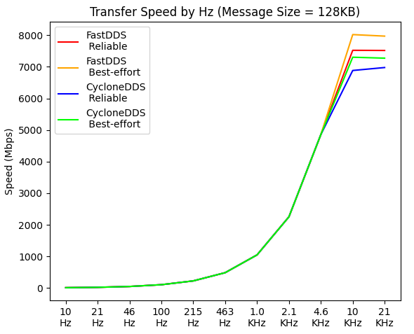
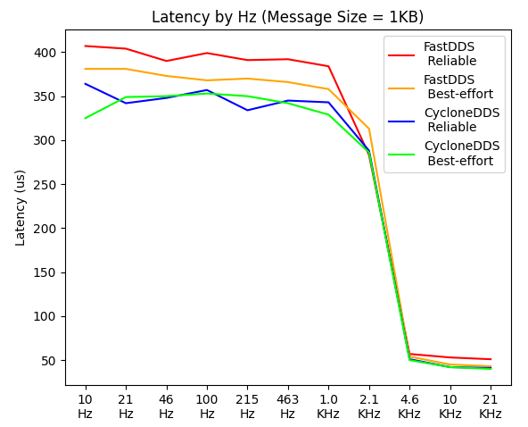

# (2023-01-15) 分散ROS2 FastDDS/CycloneDDS のパフォーマンス評価
## 背景
ロボット制御ソフトウェアとして有名な ROS(Robot Operationg System) は、近年ゆっくりと ROS1 から ROS2 への移行が始まっています。  
そして ROS1 から ROS2 への変化として大きいものの一つが、通信ミドルウェアである DDS(Data Distribution Service)の採用です。  

ROS2 では比較的自由に使えるDDSとして FastDDS、CycloneDDS の2つがメジャーとなっています。  
このドキュメントでは「分散ノードにおける FastDDS、CycloneDDS のパフォーマンス」を様々な切り口で調べることで、ROS2を使う方々に基礎データを提供できればと思います。

## テスト環境
テスト環境は下記の通りです。
- ハードウェア：10GB NIC 対向で直結された 2台のPC（i5-8600K/i5-6500）
- 時刻同期：DDS通信とは別NIC（ハードウェア・タイムスタンプ機能付）を用いて IEEE1588/PTPにより同期。
- OS/ROS2/DDSのバージョン
  - Ubuntu22.04.1 LTS（カーネルパラメータ変更なし）。
  - ROS2 humble。
  - FastRTPS: ver2.6.2 (Ubuntu22.04.1 LTS ROS2-Humble の標準)。
  - CycloneDDS: ver0.9.0 (Ubuntu22.04.1 LTS ROS2-Humble の標準)。
- テストコード: C++でPub/Subノードを実装（全組み合わせテストの制御はPython）

## テスト方法
DDS種類/QOS/メッセージサイズ/配信レート(Hz) の全組み合わせについて、実効転送レート・パケットロス率・レイテンシを測定しています。  
各テストは、30秒間のPub/Sub通信で測定しています（総組み合わせ548回の計測、総時間5時間）。  
QoS の Reliable（再送あり） / BestEffort（再送なし） ともに Depth は 10 を使用しています。

## 結論
FastDDS/CycloneDDS では転送レート最大となるメッセージサイズやレイテンシ特性に少し違いがあることが分かりました。  
いずれの場合も高配信レート（4.6KHz以上）では、レイテンシが大幅に改善しました。  
（また /proc/sys/net/core/busy_read (us単位)を大きな値にすることでも近い改善が得られます。ただし1コア分のCPU使用率が100%になることに注意が必要です）  

さらに ROS1のTCP送受信とは、フロー制御＆再送制御と違うため、下記のように特性が大幅に異なります。
  - QoS=Reliable であっても状況によっては、パケットロスが発生することがあります。
  - QoS=Reliable でメッセージサイズが大きくなると、レイテンシが大幅増加しやすくなります。
  - メッセージサイズが1MBを超えた状態でパケットロスが発生する状態になると、ワイヤースピードを大きく下回る速度しか出ないことがあります。

## 転送レート
FastDDSは、メッセージサイズ=128KB時に最大転送レートとなり、ピークは約8Gbps前後となります。  
CycloneDDS(BestEffort)では、メッセージサイズ=512KB時に最大転送レートとなり、ピークは約7.4Gbps前後となります。  
（なお同一PC環境で ROS1-Melodic（通信はTCP）を使うと 9Gbps 以上とワイヤースピードに近い転送レートでした）  

またTCPと違い、メッセージサイズが1MBを超えると、最大転送レートの低下が著しくなります。  

## レイテンシ
4.6KHz以上の高配信レートを使うと、レイテンシが大幅に改善します。  
具体的には、FastDDS(BestEffort) で 381us → 43us、CycloneDDS(BestEffort) で 325us → 40us と1/8程度になりました。  
これは ROS要因ではなく Linuxカーネルの挙動(NAPI) が原因と推測しています。  
（ROSを使わない単純なUDP送受信するsocketプログラムでも、毎秒5000パケット以上でレイテンシが大幅低下します）  

トリッキーですが、（空データを混ぜてでも）配信レートを上げればレイテンシは改善します。  
もう少しエレガントな方法として、NAPIの挙動を変えるカーネルパラメータを使う方法があります。  
- 具体的には NAPIで割り込み→ポーリングbusyループに遷移するカーネルパラーメータの /proc/sys/net/core/busy_read (us単位) を使います。
- これを大きな値（たとえば200,000など=200ms）にすることで、10Hz程度でも大きな改善が得られました（80us前後）。
- なおビジーポーリングのため、1コア分のCPU使用率が100%になる点に注意が必要です。
- （また socket単位での設定（SO_BUSY_POLL、ルート権限必要）もあります。ただし DDS内部の受信用socket descriptorにアクセスする必要があります）

FastDDS/CycloneDDS とも 1～2MB/メッセージあたりから（高レートの場合）、QoS=Reliable は著しくレイテンシが増大するようです。  

なお、低配信レートでは CycloneDDS の方が若干レイテンシが低い傾向にあります。

## パケットロス率
メッセージサイズが大きくなるとロス率が上がる傾向が見られ、QoS=BestEffort でより顕著でした。  
QoS=Reliable であっても、（TCPと違い）転送レート・配信レートが上がるにつれ、ロスが発生することがあるようです。  

## 生データ

下記にグラフに使った生データを掲載しておきます。

### FastDDS qos_besteffort=0 qos_depth=10
|Size|Hz|Speed(Mbps)|loss-pkt|send-pkt|loss-rate|loop-rate|latency(ave)|latency(max)|
|----|----|----|----|----|----|----|----|----|
|1024|10|0.08|0|301|0.0000|1.0033|0.407|0.458|
|1024|21|0.17|0|630|0.0000|1.0000|0.404|0.464|
|1024|46|0.38|0|1381|0.0000|1.0000|0.390|0.469|
|1024|100|0.82|0|3000|0.0000|1.0000|0.399|0.470|
|1024|215|1.76|0|6450|0.0000|1.0000|0.391|0.461|
|1024|463|3.79|0|13890|0.0000|1.0000|0.392|0.498|
|1024|1000|8.19|0|30000|0.0000|1.0000|0.384|0.688|
|1024|2150|17.61|0|64500|0.0000|1.0000|0.283|0.884|
|1024|4630|37.93|0|138901|0.0000|1.0000|0.057|0.432|
|1024|10000|81.92|0|300001|0.0000|1.0000|0.053|0.578|
|1024|21500|88.67|0|324709|0.0000|0.5034|0.051|0.883|
|2048|10|0.16|0|301|0.0000|1.0033|0.436|0.470|
|2048|21|0.34|0|630|0.0000|1.0000|0.424|0.479|
|2048|46|0.75|0|1381|0.0000|1.0007|0.430|0.492|
|2048|100|1.64|0|3000|0.0000|1.0000|0.390|0.918|
|2048|215|3.52|0|6450|0.0000|1.0000|0.410|0.758|
|2048|463|7.59|0|13890|0.0000|1.0000|0.418|0.680|
|2048|1000|16.38|0|30001|0.0000|1.0000|0.418|2.168|
|2048|2150|35.23|0|64501|0.0000|1.0000|0.342|1.013|
|2048|4630|75.86|0|138901|0.0000|1.0000|0.170|2.841|
|2048|10000|163.84|0|299996|0.0000|1.0000|0.086|0.890|
|2048|21500|178.12|0|326156|0.0000|0.5057|0.082|0.701|
|4096|10|0.33|0|301|0.0000|1.0033|0.421|0.484|
|4096|21|0.69|0|630|0.0000|1.0000|0.441|0.505|
|4096|46|1.51|0|1381|0.0000|1.0007|0.434|0.507|
|4096|100|3.28|0|3000|0.0000|1.0000|0.437|0.500|
|4096|215|7.05|0|6450|0.0000|1.0000|0.427|0.532|
|4096|463|15.17|0|13890|0.0000|1.0000|0.431|0.541|
|4096|1000|32.77|0|29999|0.0000|1.0000|0.415|3.121|
|4096|2150|70.45|0|64501|0.0000|1.0000|0.306|0.636|
|4096|4630|151.71|0|138899|0.0000|1.0000|0.158|1.296|
|4096|10000|327.68|0|299996|0.0000|1.0000|0.091|1.061|
|4096|21500|357.11|0|326945|0.0000|0.5069|0.083|1.053|
|8192|10|0.66|0|301|0.0000|1.0033|0.430|0.477|
|8192|21|1.38|0|630|0.0000|1.0000|0.440|0.501|
|8192|46|3.01|0|1380|0.0000|1.0000|0.458|0.565|
|8192|100|6.55|0|3001|0.0000|1.0003|0.422|0.495|
|8192|215|14.09|0|6450|0.0000|1.0000|0.450|0.545|
|8192|463|30.34|0|13890|0.0000|1.0000|0.443|0.550|
|8192|1000|65.54|0|30000|0.0000|1.0000|0.436|1.812|
|8192|2150|140.90|0|64500|0.0000|1.0000|0.289|1.326|
|8192|4630|303.44|0|138902|0.0000|1.0000|0.137|1.292|
|8192|10000|655.32|0|299984|0.0000|0.9999|0.172|0.877|
|8192|21500|718.29|0|328806|0.0000|0.5098|0.172|0.933|
|16384|10|1.31|0|301|0.0000|1.0033|0.507|0.563|
|16384|21|2.75|0|630|0.0000|1.0000|0.502|0.565|
|16384|46|6.03|0|1381|0.0000|1.0007|0.489|0.562|
|16384|100|13.11|0|3000|0.0000|1.0000|0.496|0.601|
|16384|215|28.18|0|6451|0.0000|1.0002|0.492|0.712|
|16384|463|60.69|0|13890|0.0000|1.0000|0.490|0.661|
|16384|1000|131.07|0|30000|0.0000|1.0000|0.467|0.686|
|16384|2150|281.81|0|64501|0.0000|1.0000|0.299|1.727|
|16384|4630|606.87|0|138903|0.0000|1.0000|0.149|0.514|
|16384|10000|1310.71|0|299999|0.0000|1.0000|0.156|1.337|
|16384|21500|1456.65|0|333401|0.0000|0.5169|0.149|0.570|
|32768|10|2.62|0|301|0.0000|1.0033|0.601|0.710|
|32768|21|5.51|0|630|0.0000|1.0000|0.589|0.701|
|32768|46|12.06|0|1380|0.0000|1.0000|0.582|0.673|
|32768|100|26.21|0|3000|0.0000|1.0000|0.578|0.691|
|32768|215|56.36|0|6451|0.0000|1.0002|0.583|0.780|
|32768|463|121.37|0|13890|0.0000|1.0000|0.578|0.713|
|32768|1000|262.14|0|30000|0.0000|1.0000|0.571|1.336|
|32768|2150|563.61|0|64501|0.0000|1.0000|0.362|1.817|
|32768|4630|1213.73|0|138901|0.0000|1.0000|0.171|0.530|
|32768|10000|2621.20|28|300000|0.0001|1.0000|0.168|1.848|
|32768|21500|5170.79|15|591767|0.0000|0.9175|0.168|0.966|
|65536|10|5.24|0|301|0.0000|1.0033|0.758|0.840|
|65536|21|11.01|0|630|0.0000|1.0000|0.771|0.928|
|65536|46|24.12|0|1381|0.0000|1.0007|0.761|0.839|
|65536|100|52.43|0|3000|0.0000|1.0000|0.757|0.877|
|65536|215|112.72|0|6450|0.0000|1.0000|0.760|0.904|
|65536|463|242.74|0|13890|0.0000|1.0000|0.756|0.861|
|65536|1000|524.29|0|30000|0.0000|1.0000|0.725|2.669|
|65536|2150|1127.22|0|64501|0.0000|1.0000|0.473|1.520|
|65536|4630|2427.51|0|138904|0.0000|1.0000|0.223|0.806|
|65536|10000|5237.59|18|299716|0.0001|0.9991|0.214|1.790|
|65536|21500|5783.27|9|330931|0.0000|0.5131|0.219|1.368|
|131072|10|10.49|0|301|0.0000|1.0033|1.044|1.317|
|131072|21|22.02|0|630|0.0000|1.0000|0.992|1.142|
|131072|46|48.23|0|1380|0.0000|1.0000|1.027|1.240|
|131072|100|104.86|0|3000|0.0000|1.0000|1.020|1.180|
|131072|215|225.44|0|6450|0.0000|1.0000|1.034|1.205|
|131072|463|485.49|0|13890|0.0000|1.0000|1.035|1.487|
|131072|1000|1048.54|1|30000|0.0000|1.0000|0.825|10.627|
|131072|2150|2254.46|0|64501|0.0000|1.0000|0.434|1.117|
|131072|4630|4853.06|60|138908|0.0004|1.0001|0.281|2.582|
|131072|10000|7522.26|260|215474|0.0012|0.7182|0.276|3.237|
|131072|21500|7516.83|195|215254|0.0009|0.3337|0.274|2.740|
|262144|10|20.98|0|301|0.0000|1.0033|2.242|12.077|
|262144|21|44.04|0|630|0.0000|1.0000|1.649|1.800|
|262144|46|96.47|0|1381|0.0000|1.0007|1.609|1.820|
|262144|100|209.71|0|3000|0.0000|1.0000|1.660|12.024|
|262144|215|450.88|0|6450|0.0000|1.0000|1.727|12.476|
|262144|463|970.41|8|13890|0.0006|1.0000|1.428|21.613|
|262144|1000|2088.15|126|29998|0.0042|0.9999|0.832|11.022|
|262144|2150|4508.88|1|64502|0.0000|1.0000|0.466|4.566|
|262144|4630|6373.15|1|91170|0.0000|0.6564|0.474|3.175|
|262144|10000|6464.99|7|92490|0.0001|0.3083|0.471|5.283|
|524288|10|41.96|0|301|0.0000|1.0033|2.791|3.983|
|524288|21|88.08|0|630|0.0000|1.0000|3.438|24.206|
|524288|46|192.93|0|1380|0.0000|1.0000|2.925|23.956|
|524288|100|419.73|0|3003|0.0000|1.0010|3.431|44.056|
|524288|215|901.76|0|6450|0.0000|1.0000|2.824|22.133|
|524288|463|1923.25|1|13758|0.0001|0.9905|1.613|23.829|
|524288|1000|4179.35|93|29987|0.0031|0.9996|0.966|13.024|
|524288|2150|6705.44|1|47963|0.0000|0.7436|0.789|5.970|
|524288|4630|6783.54|8|48528|0.0002|0.3494|0.788|14.276|
|1048576|10|83.93|0|301|0.0000|1.0033|5.072|7.625|
|1048576|21|176.15|0|630|0.0000|1.0000|5.157|54.840|
|1048576|46|385.84|0|1380|0.0000|1.0000|5.370|37.440|
|1048576|100|838.79|0|3000|0.0000|1.0000|5.305|51.066|
|1048576|215|1801.90|0|6445|0.0000|0.9992|3.479|28.609|
|1048576|463|3551.60|33|12735|0.0026|0.9168|2.951|35.487|
|1048576|1000|6298.81|41|22568|0.0018|0.7523|1.623|14.753|
|1048576|2150|6444.29|17|23064|0.0007|0.3576|1.552|17.048|
|2097152|10|167.88|0|301|0.0000|1.0033|10.283|12.914|
|2097152|21|352.45|0|631|0.0000|1.0016|10.225|41.963|
|2097152|46|771.83|0|1381|0.0000|1.0007|11.725|30.103|
|2097152|100|1675.19|0|2996|0.0000|0.9987|9.012|104.424|
|2097152|215|3238.00|17|5811|0.0029|0.9004|11.506|58.099|
|2097152|463|4403.47|3276|11153|0.2937|0.8027|20.556|33.170|
|2097152|1000|4229.98|3079|10644|0.2893|0.3548|22.111|32.128|
|4194304|10|335.82|0|301|0.0000|1.0033|19.916|26.028|
|4194304|21|704.66|0|631|0.0000|1.0016|22.592|33.168|
|4194304|46|1543.38|0|1380|0.0000|1.0000|13.888|58.531|
|4194304|100|3260.36|37|2957|0.0125|0.9840|27.773|145.440|
|4194304|215|4266.63|1304|5122|0.2546|0.7935|37.603|57.945|
|4194304|463|3937.31|1589|5111|0.3109|0.3678|47.304|63.280|
|8388608|10|671.61|0|301|0.0000|1.0033|32.690|57.887|
|8388608|21|1408.43|0|631|0.0000|1.0000|27.574|84.063|
|8388608|46|2956.25|0|1323|0.0000|0.9580|35.404|157.545|
|8388608|100|4174.16|646|2512|0.2572|0.8373|86.734|150.674|
|8388608|215|4453.66|691|2682|0.2576|0.4158|75.172|154.181|
|16777216|10|1342.79|0|301|0.0000|1.0033|49.602|74.347|
|16777216|21|2812.22|0|630|0.0000|0.9984|48.109|206.217|
|16777216|46|4348.14|326|1298|0.2512|0.9406|176.975|308.151|
|16777216|100|4176.03|306|1242|0.2464|0.4129|152.392|298.379|

### FastDDS qos_besteffort=1 qos_depth=10
|Size|Hz|Speed(Mbps)|loss-pkt|send-pkt|loss-rate|loop-rate|latency(ave)|latency(max)|
|----|----|----|----|----|----|----|----|----|
|1024|10|0.08|0|301|0.0000|1.0033|0.381|0.409|
|1024|21|0.17|0|630|0.0000|1.0000|0.381|0.420|
|1024|46|0.38|0|1380|0.0000|1.0000|0.373|0.440|
|1024|100|0.82|0|3000|0.0000|1.0000|0.368|0.431|
|1024|215|1.76|0|6450|0.0000|1.0000|0.370|0.464|
|1024|463|3.79|0|13890|0.0000|1.0000|0.366|0.524|
|1024|1000|8.19|0|30000|0.0000|1.0000|0.358|1.554|
|1024|2150|17.61|0|64497|0.0000|1.0000|0.313|0.673|
|1024|4630|37.93|0|138902|0.0000|1.0000|0.054|0.324|
|1024|10000|81.92|0|300002|0.0000|1.0000|0.045|0.514|
|1024|21500|88.10|0|322630|0.0000|0.5002|0.043|0.544|
|2048|10|0.16|0|301|0.0000|1.0033|0.408|0.438|
|2048|21|0.34|0|630|0.0000|1.0000|0.402|0.441|
|2048|46|0.75|0|1380|0.0000|1.0000|0.398|0.452|
|2048|100|1.64|0|3000|0.0000|1.0000|0.365|0.453|
|2048|215|3.52|0|6451|0.0000|1.0002|0.393|0.459|
|2048|463|7.59|0|13890|0.0000|1.0000|0.391|0.507|
|2048|1000|16.38|0|30000|0.0000|1.0000|0.387|0.498|
|2048|2150|35.23|0|64500|0.0000|1.0000|0.338|3.093|
|2048|4630|75.86|0|138900|0.0000|1.0000|0.156|1.411|
|2048|10000|163.84|7|300002|0.0000|1.0000|0.083|1.851|
|2048|21500|176.41|6|323020|0.0000|0.5008|0.081|1.739|
|4096|10|0.33|0|301|0.0000|1.0033|0.411|0.443|
|4096|21|0.69|0|631|0.0000|1.0016|0.404|0.456|
|4096|46|1.51|0|1380|0.0000|1.0000|0.405|0.492|
|4096|100|3.28|0|3000|0.0000|1.0000|0.395|0.511|
|4096|215|7.05|0|6451|0.0000|1.0002|0.398|0.528|
|4096|463|15.17|0|13890|0.0000|1.0000|0.401|0.592|
|4096|1000|32.77|0|30000|0.0000|1.0000|0.394|0.580|
|4096|2150|70.44|9|64500|0.0001|1.0000|0.329|12.133|
|4096|4630|151.72|0|138901|0.0000|1.0000|0.154|1.190|
|4096|10000|327.68|0|300000|0.0000|1.0000|0.087|0.780|
|4096|21500|353.02|0|323198|0.0000|0.5011|0.082|0.771|
|8192|10|0.66|0|301|0.0000|1.0033|0.439|0.489|
|8192|21|1.38|0|630|0.0000|1.0000|0.433|0.472|
|8192|46|3.01|0|1380|0.0000|1.0000|0.422|0.485|
|8192|100|6.55|0|3001|0.0000|1.0003|0.428|0.497|
|8192|215|14.09|0|6450|0.0000|1.0000|0.418|0.500|
|8192|463|30.34|0|13890|0.0000|1.0000|0.421|0.500|
|8192|1000|65.54|0|30000|0.0000|1.0000|0.415|0.662|
|8192|2150|140.88|10|64500|0.0002|1.0000|0.315|12.238|
|8192|4630|303.43|0|138902|0.0000|1.0000|0.140|0.749|
|8192|10000|655.32|8|299990|0.0000|1.0000|0.169|1.986|
|8192|21500|707.55|0|323892|0.0000|0.5022|0.165|0.800|
|16384|10|1.31|0|301|0.0000|1.0033|0.477|0.514|
|16384|21|2.75|0|630|0.0000|1.0000|0.477|0.532|
|16384|46|6.03|0|1380|0.0000|1.0000|0.467|0.529|
|16384|100|13.11|0|3000|0.0000|1.0000|0.467|0.581|
|16384|215|28.18|0|6450|0.0000|1.0000|0.463|0.544|
|16384|463|60.69|0|13890|0.0000|1.0000|0.469|1.885|
|16384|1000|131.07|0|29999|0.0000|1.0000|0.450|0.596|
|16384|2150|281.81|0|64501|0.0000|1.0000|0.369|0.893|
|16384|4630|606.87|0|138902|0.0000|1.0000|0.151|0.614|
|16384|10000|1310.71|5|300002|0.0000|1.0000|0.173|1.241|
|16384|21500|1427.61|11|326765|0.0000|0.5066|0.171|1.145|
|32768|10|2.62|0|301|0.0000|1.0033|0.568|0.601|
|32768|21|5.51|0|631|0.0000|1.0016|0.564|0.631|
|32768|46|12.06|0|1380|0.0000|1.0000|0.558|0.644|
|32768|100|26.21|0|3000|0.0000|1.0000|0.555|0.673|
|32768|215|56.36|0|6450|0.0000|1.0000|0.555|0.641|
|32768|463|121.37|0|13890|0.0000|1.0000|0.555|0.725|
|32768|1000|262.14|0|30000|0.0000|1.0000|0.547|2.152|
|32768|2150|563.61|0|64501|0.0000|1.0000|0.369|1.567|
|32768|4630|1213.73|0|138902|0.0000|1.0000|0.180|0.540|
|32768|10000|2621.28|22|300004|0.0001|1.0000|0.164|1.678|
|32768|21500|4139.36|76|473788|0.0002|0.7346|0.165|4.927|
|65536|10|5.24|0|301|0.0000|1.0033|0.773|0.847|
|65536|21|11.01|0|630|0.0000|1.0000|0.705|0.839|
|65536|46|24.12|0|1380|0.0000|1.0000|0.742|0.826|
|65536|100|52.43|0|3000|0.0000|1.0000|0.743|0.811|
|65536|215|112.72|0|6451|0.0000|1.0002|0.733|2.329|
|65536|463|242.74|0|13890|0.0000|1.0000|0.744|0.940|
|65536|1000|524.28|0|30000|0.0000|1.0000|0.721|1.126|
|65536|2150|1127.22|0|64501|0.0000|1.0000|0.494|2.078|
|65536|4630|2427.49|0|138903|0.0000|1.0000|0.217|0.679|
|65536|10000|5241.83|72|300012|0.0002|1.0000|0.195|1.475|
|65536|21500|7095.17|17|406007|0.0000|0.6295|0.197|1.776|
|131072|10|10.49|0|301|0.0000|1.0033|1.064|1.246|
|131072|21|22.02|0|630|0.0000|1.0000|1.036|1.157|
|131072|46|48.23|0|1380|0.0000|1.0000|1.046|1.222|
|131072|100|104.86|0|3000|0.0000|1.0000|0.974|1.129|
|131072|215|225.44|0|6450|0.0000|1.0000|1.044|1.246|
|131072|463|485.48|0|13890|0.0000|1.0000|1.036|1.257|
|131072|1000|1048.57|0|30000|0.0000|1.0000|0.826|1.744|
|131072|2150|2254.47|0|64501|0.0000|1.0000|0.441|0.961|
|131072|4630|4854.31|20|138903|0.0001|1.0000|0.269|0.991|
|131072|10000|8019.50|1036|230476|0.0045|0.7683|0.267|2.293|
|131072|21500|7971.24|310|228370|0.0014|0.3541|0.267|2.067|
|262144|10|20.97|0|301|0.0000|1.0033|1.599|2.274|
|262144|21|43.69|5|631|0.0079|1.0016|1.644|1.788|
|262144|46|95.14|19|1380|0.0138|1.0000|1.597|1.778|
|262144|100|207.90|26|3001|0.0087|1.0003|1.624|1.757|
|262144|215|448.15|39|6450|0.0060|1.0000|1.630|1.821|
|262144|463|963.56|106|13890|0.0076|1.0000|1.438|1.907|
|262144|1000|2014.03|1190|30001|0.0397|1.0000|0.691|1.612|
|262144|2150|4508.92|1|64502|0.0000|1.0000|0.461|1.169|
|262144|4630|6691.67|3|95729|0.0000|0.6892|0.466|1.691|
|262144|10000|6525.87|3|93357|0.0000|0.3112|0.475|1.638|
|524288|10|41.81|1|301|0.0033|1.0033|2.753|3.385|
|524288|21|86.68|10|630|0.0159|1.0000|2.750|3.049|
|524288|46|189.85|22|1380|0.0159|1.0000|2.792|3.293|
|524288|100|417.60|13|3000|0.0043|1.0000|2.736|3.092|
|524288|215|899.92|13|6450|0.0020|1.0000|2.762|3.116|
|524288|463|1904.51|249|13872|0.0179|0.9987|1.647|10.993|
|524288|1000|4193.47|7|30002|0.0002|1.0000|0.884|6.100|
|524288|2150|6896.33|2|49329|0.0000|0.7648|0.775|2.081|
|524288|4630|6738.78|5|48205|0.0001|0.3470|0.791|2.132|
|1048576|10|81.11|10|301|0.0332|1.0033|5.335|7.581|
|1048576|21|170.83|19|630|0.0302|1.0000|5.229|6.141|
|1048576|46|383.88|7|1380|0.0051|1.0000|5.185|5.509|
|1048576|100|837.68|4|3000|0.0013|1.0000|5.402|6.311|
|1048576|215|1757.46|164|6450|0.0254|1.0000|3.289|15.845|
|1048576|463|3420.62|338|12572|0.0269|0.9050|2.215|10.922|
|1048576|1000|6639.39|9|23754|0.0004|0.7918|1.496|2.491|
|1048576|2150|6617.06|6|23671|0.0003|0.3670|1.488|2.764|
|2097152|10|165.56|4|301|0.0133|1.0033|9.854|14.841|
|2097152|21|351.13|2|630|0.0032|1.0000|11.182|12.336|
|2097152|46|771.62|0|1380|0.0000|1.0000|10.515|11.094|
|2097152|100|1619.28|104|3000|0.0347|1.0000|7.821|14.377|
|2097152|215|3077.34|504|6007|0.0839|0.9313|4.770|11.814|
|2097152|463|3093.84|5375|10908|0.4928|0.7853|3.374|4.322|
|2097152|1000|3126.16|5413|11004|0.4919|0.3667|3.340|4.752|
|4194304|10|334.49|1|301|0.0033|1.0033|20.063|25.183|
|4194304|21|699.92|4|630|0.0063|1.0000|20.522|21.683|
|4194304|46|1535.08|7|1380|0.0051|1.0000|15.521|21.811|
|4194304|100|2229.06|1007|3000|0.3357|1.0000|10.581|20.698|
|4194304|215|3016.47|2697|5394|0.5000|0.8363|6.932|8.358|
|4194304|463|2977.29|2662|5324|0.5000|0.3833|7.100|8.524|
|8388608|10|653.57|8|301|0.0266|1.0033|39.876|43.872|
|8388608|21|1338.07|32|631|0.0507|1.0016|26.517|42.059|
|8388608|46|2130.53|428|1381|0.3099|1.0007|21.117|38.252|
|8388608|100|2992.91|1337|2675|0.4998|0.8917|13.841|30.310|
|8388608|215|2913.06|1304|2607|0.5002|0.4040|14.017|30.194|
|16777216|10|1337.93|1|301|0.0033|1.0033|50.601|59.645|
|16777216|21|2384.72|97|631|0.1537|1.0000|40.744|64.473|
|16777216|46|2884.47|647|1292|0.5008|0.9362|28.519|44.738|
|16777216|100|2900.51|651|1300|0.5008|0.4329|27.593|39.869|

### CycloneDDS qos_besteffort=0 qos_depth=10
|Size|Hz|Speed(Mbps)|loss-pkt|send-pkt|loss-rate|loop-rate|latency(ave)|latency(max)|
|----|----|----|----|----|----|----|----|----|
|1024|10|0.08|0|301|0.0000|1.0033|0.364|0.407|
|1024|21|0.17|0|630|0.0000|1.0000|0.342|0.390|
|1024|46|0.38|0|1381|0.0000|1.0007|0.348|0.416|
|1024|100|0.82|0|3000|0.0000|1.0000|0.357|0.412|
|1024|215|1.76|0|6450|0.0000|1.0000|0.334|0.411|
|1024|463|3.79|0|13890|0.0000|1.0000|0.345|2.175|
|1024|1000|8.19|0|29999|0.0000|1.0000|0.343|0.594|
|1024|2150|17.61|0|64501|0.0000|1.0000|0.288|0.656|
|1024|4630|37.93|0|138906|0.0000|1.0000|0.051|0.976|
|1024|10000|81.92|0|300006|0.0000|1.0000|0.042|0.938|
|1024|21500|88.49|1|324059|0.0000|0.5024|0.041|1.116|
|2048|10|0.16|0|301|0.0000|1.0033|0.373|0.414|
|2048|21|0.34|0|630|0.0000|1.0000|0.379|0.423|
|2048|46|0.75|0|1380|0.0000|1.0000|0.356|0.422|
|2048|100|1.64|0|3000|0.0000|1.0000|0.356|0.452|
|2048|215|3.52|0|6450|0.0000|1.0000|0.362|0.434|
|2048|463|7.59|0|13890|0.0000|1.0000|0.367|0.596|
|2048|1000|16.38|0|30000|0.0000|1.0000|0.359|1.400|
|2048|2150|35.23|0|64501|0.0000|1.0000|0.311|1.463|
|2048|4630|75.86|0|138911|0.0000|1.0001|0.142|2.131|
|2048|10000|163.84|5|300011|0.0000|1.0000|0.080|1.066|
|2048|21500|176.17|0|322586|0.0000|0.5001|0.074|0.951|
|4096|10|0.33|0|301|0.0000|1.0033|0.390|0.449|
|4096|21|0.69|0|630|0.0000|1.0000|0.387|0.438|
|4096|46|1.51|0|1380|0.0000|1.0000|0.359|0.430|
|4096|100|3.28|0|3000|0.0000|1.0000|0.380|0.480|
|4096|215|7.05|0|6451|0.0000|1.0002|0.377|0.476|
|4096|463|15.17|0|13890|0.0000|1.0000|0.370|0.446|
|4096|1000|32.77|0|30000|0.0000|1.0000|0.372|1.444|
|4096|2150|70.45|0|64499|0.0000|1.0000|0.304|0.749|
|4096|4630|151.72|0|138906|0.0000|1.0000|0.151|1.408|
|4096|10000|327.69|0|300009|0.0000|1.0000|0.082|1.133|
|4096|21500|353.37|2|323519|0.0000|0.5016|0.078|1.374|
|8192|10|0.66|0|301|0.0000|1.0033|0.412|0.505|
|8192|21|1.38|0|630|0.0000|1.0000|0.384|0.471|
|8192|46|3.01|0|1380|0.0000|1.0000|0.403|0.457|
|8192|100|6.55|0|3001|0.0000|1.0003|0.371|0.456|
|8192|215|14.09|0|6450|0.0000|1.0000|0.396|0.499|
|8192|463|30.34|0|13891|0.0000|1.0001|0.390|0.688|
|8192|1000|65.54|0|30000|0.0000|1.0000|0.378|0.500|
|8192|2150|140.91|0|64502|0.0000|1.0000|0.308|1.822|
|8192|4630|303.44|0|138903|0.0000|1.0000|0.124|0.727|
|8192|10000|655.36|5|300007|0.0000|1.0000|0.162|1.196|
|8192|21500|705.68|1|323036|0.0000|0.5008|0.162|0.976|
|16384|10|1.31|0|301|0.0000|1.0033|0.467|0.568|
|16384|21|2.75|0|630|0.0000|1.0000|0.457|0.512|
|16384|46|6.03|0|1380|0.0000|1.0000|0.452|0.526|
|16384|100|13.11|0|3000|0.0000|1.0000|0.445|0.493|
|16384|215|28.18|0|6450|0.0000|1.0000|0.443|0.735|
|16384|463|60.69|0|13890|0.0000|1.0000|0.447|1.536|
|16384|1000|131.07|0|30000|0.0000|1.0000|0.436|1.006|
|16384|2150|281.81|0|64502|0.0000|1.0000|0.354|1.450|
|16384|4630|606.88|0|138904|0.0000|1.0000|0.147|1.026|
|16384|10000|1310.76|0|300009|0.0000|1.0000|0.173|1.152|
|16384|21500|1421.73|0|325409|0.0000|0.5045|0.169|1.389|
|32768|10|2.62|0|301|0.0000|1.0033|0.525|0.683|
|32768|21|5.51|0|631|0.0000|1.0016|0.488|0.590|
|32768|46|12.06|0|1381|0.0000|1.0007|0.490|0.573|
|32768|100|26.21|0|3000|0.0000|1.0000|0.481|0.558|
|32768|215|56.36|0|6450|0.0000|1.0000|0.481|0.786|
|32768|463|121.37|0|13891|0.0000|1.0001|0.494|0.697|
|32768|1000|262.13|0|29999|0.0000|1.0000|0.486|0.779|
|32768|2150|563.63|0|64503|0.0000|1.0000|0.378|0.992|
|32768|4630|1213.79|0|138907|0.0000|1.0001|0.159|1.335|
|32768|10000|2621.44|31|300031|0.0001|1.0001|0.154|3.604|
|32768|21500|3835.34|1|438921|0.0000|0.6805|0.141|1.212|
|65536|10|5.24|0|301|0.0000|1.0033|0.643|0.816|
|65536|21|11.01|0|631|0.0000|1.0000|0.571|0.756|
|65536|46|24.12|0|1380|0.0000|1.0000|0.555|0.715|
|65536|100|52.43|0|3000|0.0000|1.0000|0.590|0.761|
|65536|215|112.72|0|6450|0.0000|1.0000|0.557|0.796|
|65536|463|242.74|0|13890|0.0000|1.0000|0.693|0.979|
|65536|1000|524.29|0|30000|0.0000|1.0000|0.621|0.876|
|65536|2150|1127.26|0|64503|0.0000|1.0000|0.418|1.571|
|65536|4630|2427.08|0|138879|0.0000|0.9998|0.181|8.016|
|65536|10000|5242.12|3|299961|0.0000|0.9999|0.151|1.969|
|65536|21500|6358.91|671|364535|0.0018|0.5652|0.189|1.978|
|131072|10|10.49|0|301|0.0000|1.0033|0.979|1.212|
|131072|21|22.02|0|630|0.0000|1.0000|0.808|1.108|
|131072|46|48.24|0|1381|0.0000|1.0007|0.871|1.108|
|131072|100|104.86|0|3000|0.0000|1.0000|0.803|1.160|
|131072|215|225.44|0|6450|0.0000|1.0000|0.850|1.765|
|131072|463|485.49|0|13890|0.0000|1.0000|0.869|2.059|
|131072|1000|1048.57|0|30000|0.0000|1.0000|0.695|2.236|
|131072|2150|2254.20|0|64494|0.0000|0.9999|0.383|1.916|
|131072|4630|4855.27|3|138914|0.0000|1.0001|0.208|3.293|
|131072|10000|6883.67|5923|202867|0.0292|0.6762|0.339|3.479|
|131072|21500|6976.87|3523|203133|0.0173|0.3149|0.288|3.720|
|262144|10|20.97|0|301|0.0000|1.0033|1.488|2.772|
|262144|21|44.04|0|630|0.0000|1.0000|1.525|2.000|
|262144|46|96.47|0|1380|0.0000|1.0000|1.351|2.037|
|262144|100|209.71|0|3000|0.0000|1.0000|1.510|2.091|
|262144|215|450.89|0|6451|0.0000|1.0002|1.416|1.888|
|262144|463|970.97|0|13890|0.0000|1.0000|1.357|2.717|
|262144|1000|2096.75|0|29995|0.0000|0.9998|0.720|1.897|
|262144|2150|4509.51|3|64513|0.0000|1.0002|0.388|5.646|
|262144|4630|5066.23|24292|96765|0.2510|0.6967|1.947|5.242|
|262144|10000|6476.49|7238|99885|0.0725|0.3330|0.783|5.128|
|524288|10|41.95|0|301|0.0000|1.0033|8.143|205.916|
|524288|21|88.08|0|630|0.0000|1.0000|2.979|101.813|
|524288|46|192.93|0|1380|0.0000|1.0000|3.082|72.090|
|524288|100|418.58|6|3000|0.0020|1.0000|3.766|114.313|
|524288|215|901.24|4|6451|0.0006|1.0002|3.020|50.661|
|524288|463|1938.73|16|13884|0.0012|0.9995|1.772|25.190|
|524288|1000|4185.56|42|29980|0.0014|0.9993|0.784|16.097|
|524288|2150|6111.37|7749|51461|0.1506|0.7978|1.432|8.792|
|524288|4630|5701.69|11270|52052|0.2165|0.3747|1.830|8.882|
|1048576|10|83.90|0|301|0.0000|1.0033|5.535|8.427|
|1048576|21|176.15|0|630|0.0000|1.0000|5.544|8.865|
|1048576|46|385.89|0|1381|0.0000|1.0007|5.457|9.080|
|1048576|100|837.43|5|3001|0.0017|1.0000|6.297|101.577|
|1048576|215|1780.04|73|6439|0.0113|0.9983|6.540|55.511|
|1048576|463|3509.02|297|12851|0.0231|0.9249|4.236|42.721|
|1048576|1000|5215.48|4133|22785|0.1814|0.7595|9.247|20.108|
|1048576|2150|5517.16|4957|24696|0.2007|0.3827|8.236|16.356|
|2097152|10|167.84|0|301|0.0000|1.0033|8.276|15.266|
|2097152|21|352.29|0|630|0.0000|1.0000|13.718|412.228|
|2097152|46|771.66|0|1380|0.0000|1.0000|10.665|15.354|
|2097152|100|1627.48|91|3002|0.0303|1.0007|18.073|121.463|
|2097152|215|2713.35|1043|5901|0.1767|0.9138|30.236|68.039|
|2097152|463|3865.20|5079|11991|0.4236|0.8633|23.156|35.804|
|2097152|1000|4236.55|4157|11735|0.3542|0.3910|23.308|37.166|
|4194304|10|335.70|0|301|0.0000|1.0033|20.217|310.084|
|4194304|21|704.40|0|630|0.0000|1.0000|19.496|83.408|
|4194304|46|1529.93|12|1380|0.0087|1.0000|22.797|257.325|
|4194304|100|2611.83|575|2915|0.1973|0.9697|67.957|129.128|
|4194304|215|4404.81|2186|6126|0.3568|0.9495|44.038|57.703|
|4194304|463|4170.27|2224|5953|0.3736|0.4286|47.136|76.889|
|8388608|10|671.89|0|301|0.0000|1.0033|37.131|46.782|
|8388608|21|1408.31|0|630|0.0000|1.0000|31.039|88.814|
|8388608|46|2568.52|224|1377|0.1627|0.9942|134.204|238.675|
|8388608|100|4182.45|976|2846|0.3429|0.9487|92.849|129.327|
|8388608|215|4137.05|995|2845|0.3497|0.4409|94.034|130.296|
|16777216|10|1343.45|0|301|0.0000|1.0033|57.925|471.657|
|16777216|21|2819.20|0|631|0.0000|1.0016|39.600|76.103|
|16777216|46|3960.84|479|1365|0.3509|0.9884|199.888|259.818|
|16777216|100|4202.57|541|1483|0.3648|0.4930|184.974|257.201|

### CycloneDDS qos_besteffort=1 qos_depth=10
|Size|Hz|Speed(Mbps)|loss-pkt|send-pkt|loss-rate|loop-rate|latency(ave)|latency(max)|
|----|----|----|----|----|----|----|----|----|
|1024|10|0.08|0|301|0.0000|1.0033|0.325|0.346|
|1024|21|0.17|0|630|0.0000|1.0000|0.349|0.429|
|1024|46|0.38|0|1380|0.0000|1.0000|0.350|0.412|
|1024|100|0.82|0|3000|0.0000|1.0000|0.353|0.420|
|1024|215|1.76|0|6451|0.0000|1.0002|0.350|0.640|
|1024|463|3.79|0|13890|0.0000|1.0000|0.342|0.438|
|1024|1000|8.19|0|30000|0.0000|1.0000|0.329|0.419|
|1024|2150|17.61|0|64500|0.0000|1.0000|0.286|2.012|
|1024|4630|37.93|0|138901|0.0000|1.0000|0.050|0.464|
|1024|10000|81.92|0|300001|0.0000|1.0000|0.042|0.541|
|1024|21500|88.08|0|322569|0.0000|0.5001|0.040|0.521|
|2048|10|0.16|0|301|0.0000|1.0033|0.355|0.391|
|2048|21|0.34|0|631|0.0000|1.0016|0.375|0.433|
|2048|46|0.75|0|1381|0.0000|1.0007|0.353|0.419|
|2048|100|1.64|0|3000|0.0000|1.0000|0.370|0.403|
|2048|215|3.52|0|6450|0.0000|1.0000|0.358|0.523|
|2048|463|7.59|0|13890|0.0000|1.0000|0.361|0.623|
|2048|1000|16.38|0|30000|0.0000|1.0000|0.359|0.534|
|2048|2150|35.23|0|64500|0.0000|1.0000|0.322|1.219|
|2048|4630|75.86|0|138901|0.0000|1.0000|0.135|1.762|
|2048|10000|163.84|0|300000|0.0000|1.0000|0.077|1.035|
|2048|21500|176.17|0|322573|0.0000|0.5001|0.071|0.904|
|4096|10|0.33|0|301|0.0000|1.0000|0.355|0.382|
|4096|21|0.69|0|630|0.0000|1.0000|0.372|0.423|
|4096|46|1.51|0|1380|0.0000|1.0000|0.380|0.434|
|4096|100|3.28|0|3000|0.0000|1.0000|0.371|0.400|
|4096|215|7.05|0|6451|0.0000|1.0000|0.375|0.468|
|4096|463|15.17|0|13890|0.0000|1.0000|0.373|0.479|
|4096|1000|32.77|0|30000|0.0000|1.0000|0.367|0.454|
|4096|2150|70.45|0|64500|0.0000|1.0000|0.300|1.281|
|4096|4630|151.72|0|138901|0.0000|1.0000|0.154|1.527|
|4096|10000|327.68|0|300002|0.0000|1.0000|0.081|0.884|
|4096|21500|354.50|81|324639|0.0002|0.5033|0.078|2.098|
|8192|10|0.66|0|301|0.0000|1.0033|0.401|0.418|
|8192|21|1.38|0|631|0.0000|1.0016|0.398|0.449|
|8192|46|3.01|0|1380|0.0000|1.0000|0.399|0.458|
|8192|100|6.55|0|3000|0.0000|1.0000|0.390|0.456|
|8192|215|14.09|0|6450|0.0000|1.0000|0.391|2.585|
|8192|463|30.34|0|13890|0.0000|1.0000|0.388|0.516|
|8192|1000|65.53|0|29999|0.0000|1.0000|0.381|0.713|
|8192|2150|140.90|0|64500|0.0000|1.0000|0.309|1.577|
|8192|4630|303.43|0|138900|0.0000|1.0000|0.128|0.543|
|8192|10000|655.36|0|300000|0.0000|1.0000|0.162|1.047|
|8192|21500|706.02|1|323191|0.0000|0.5011|0.159|1.221|
|16384|10|1.31|0|301|0.0000|1.0033|0.441|0.537|
|16384|21|2.75|0|630|0.0000|1.0000|0.452|0.510|
|16384|46|6.03|0|1380|0.0000|1.0000|0.433|0.487|
|16384|100|13.11|0|3000|0.0000|1.0000|0.431|0.607|
|16384|215|28.18|0|6450|0.0000|1.0000|0.428|0.501|
|16384|463|60.69|0|13890|0.0000|1.0000|0.440|0.570|
|16384|1000|131.07|0|30000|0.0000|1.0000|0.435|0.703|
|16384|2150|281.80|0|64500|0.0000|1.0000|0.355|1.101|
|16384|4630|606.87|0|138902|0.0000|1.0000|0.151|0.844|
|16384|10000|1310.70|0|299995|0.0000|1.0000|0.171|0.935|
|16384|21500|1410.46|0|322829|0.0000|0.5005|0.163|0.820|
|32768|10|2.62|0|301|0.0000|1.0033|0.487|0.522|
|32768|21|5.51|0|630|0.0000|1.0000|0.485|0.552|
|32768|46|12.06|0|1380|0.0000|1.0000|0.483|0.540|
|32768|100|26.21|0|3000|0.0000|1.0000|0.477|0.527|
|32768|215|56.36|0|6450|0.0000|1.0000|0.477|0.592|
|32768|463|121.37|0|13890|0.0000|1.0000|0.475|1.575|
|32768|1000|262.14|0|30000|0.0000|1.0000|0.481|1.969|
|32768|2150|563.59|0|64498|0.0000|1.0000|0.374|0.649|
|32768|4630|1213.74|0|138902|0.0000|1.0000|0.149|0.667|
|32768|10000|2621.21|32|300006|0.0001|1.0000|0.155|1.410|
|32768|21500|3088.23|17|353438|0.0000|0.5480|0.152|2.352|
|65536|10|5.24|0|301|0.0000|1.0033|0.609|0.653|
|65536|21|11.01|0|631|0.0000|1.0016|0.555|0.644|
|65536|46|24.12|0|1380|0.0000|1.0000|0.555|0.676|
|65536|100|52.43|0|3001|0.0000|1.0003|0.556|0.676|
|65536|215|112.72|0|6450|0.0000|1.0000|0.545|0.757|
|65536|463|242.75|0|13891|0.0000|1.0000|0.557|10.735|
|65536|1000|524.29|0|30001|0.0000|1.0000|0.582|0.823|
|65536|2150|1127.22|0|64500|0.0000|1.0000|0.416|1.433|
|65536|4630|2427.50|0|138903|0.0000|1.0000|0.178|3.663|
|65536|10000|5242.91|0|300003|0.0000|1.0000|0.142|1.680|
|65536|21500|6641.31|1032|381052|0.0027|0.5908|0.173|5.596|
|131072|10|10.49|0|301|0.0000|1.0033|0.872|1.165|
|131072|21|22.02|0|630|0.0000|1.0000|0.797|0.903|
|131072|46|48.23|0|1380|0.0000|1.0000|0.817|1.076|
|131072|100|104.86|0|3000|0.0000|1.0000|0.836|1.466|
|131072|215|225.44|0|6451|0.0000|1.0002|0.834|1.040|
|131072|463|485.49|0|13890|0.0000|1.0000|0.856|1.456|
|131072|1000|1048.58|0|30001|0.0000|1.0000|0.758|1.988|
|131072|2150|2253.63|0|64478|0.0000|0.9996|0.357|0.857|
|131072|4630|4855.02|0|138904|0.0000|1.0000|0.207|1.639|
|131072|10000|7303.50|4111|213066|0.0193|0.7102|0.281|2.546|
|131072|21500|7273.30|2609|210700|0.0124|0.3267|0.268|1.859|
|262144|10|20.97|0|300|0.0000|1.0000|1.435|1.963|
|262144|21|44.04|0|630|0.0000|1.0000|1.466|1.665|
|262144|46|96.47|0|1380|0.0000|1.0000|1.466|1.689|
|262144|100|209.71|0|3000|0.0000|1.0000|1.475|2.039|
|262144|215|450.88|0|6450|0.0000|1.0000|1.444|1.715|
|262144|463|970.98|0|13890|0.0000|1.0000|1.336|2.813|
|262144|1000|2093.24|5|29949|0.0002|0.9983|0.838|1.981|
|262144|2150|4508.99|0|64502|0.0000|1.0000|0.395|1.783|
|262144|4630|7215.40|494|103712|0.0048|0.7467|0.411|2.361|
|262144|10000|7122.03|560|102442|0.0055|0.3415|0.417|2.254|
|524288|10|41.67|2|301|0.0066|1.0033|2.833|3.847|
|524288|21|85.42|19|630|0.0302|1.0000|2.695|3.663|
|524288|46|190.98|14|1380|0.0101|1.0000|2.726|3.111|
|524288|100|417.19|16|3000|0.0053|1.0000|2.498|14.196|
|524288|215|895.33|46|6450|0.0071|1.0000|2.847|3.171|
|524288|463|1916.02|185|13890|0.0133|1.0000|1.732|3.880|
|524288|1000|4171.98|145|29986|0.0048|0.9995|0.813|3.734|
|524288|2150|7431.56|119|53274|0.0022|0.8260|0.721|2.816|
|524288|4630|7291.19|1005|53156|0.0189|0.3827|0.738|2.572|
|1048576|10|83.06|3|301|0.0100|1.0033|5.665|7.866|
|1048576|21|174.75|5|630|0.0079|1.0000|5.670|7.840|
|1048576|46|384.15|6|1380|0.0043|1.0000|6.069|9.584|
|1048576|100|820.64|65|3000|0.0217|1.0000|5.977|7.907|
|1048576|215|1656.58|526|6451|0.0815|1.0002|4.120|10.520|
|1048576|463|3229.58|1004|12554|0.0800|0.9038|2.496|7.135|
|1048576|1000|5156.67|9007|27449|0.3281|0.9150|1.673|3.424|
|1048576|2150|5259.96|8483|27295|0.3108|0.4232|1.665|3.650|
|2097152|10|167.80|0|301|0.0000|1.0033|10.057|20.567|
|2097152|21|342.78|17|630|0.0270|1.0000|10.408|15.321|
|2097152|46|771.69|0|1380|0.0000|1.0000|10.600|13.619|
|2097152|100|1591.78|154|3001|0.0513|1.0003|7.166|18.272|
|2097152|215|3233.15|78|5860|0.0133|0.9085|5.088|15.091|
|2097152|463|4458.49|5192|13165|0.3944|0.9477|3.809|5.726|
|2097152|1000|4820.15|4550|13170|0.3455|0.4390|3.691|5.608|
|4194304|10|334.40|1|301|0.0033|1.0000|19.579|32.943|
|4194304|21|699.89|4|630|0.0063|1.0000|21.052|30.492|
|4194304|46|1522.00|19|1380|0.0138|1.0000|16.337|32.714|
|4194304|100|2582.23|687|2997|0.2292|0.9987|11.771|27.463|
|4194304|215|3575.31|3211|6408|0.5011|0.9935|7.204|10.581|
|4194304|463|3618.70|3329|6565|0.5071|0.4726|7.134|10.889|
|8388608|10|662.88|4|301|0.0133|1.0033|37.903|55.717|
|8388608|21|1356.93|23|630|0.0365|1.0000|33.638|53.307|
|8388608|46|2135.02|426|1381|0.3085|1.0007|23.907|52.537|
|8388608|100|3711.50|1342|3002|0.4470|1.0003|15.314|21.391|
|8388608|215|3583.46|1603|3205|0.5002|0.4969|14.371|21.055|
|16777216|10|1334.61|2|301|0.0066|1.0033|58.209|103.557|
|16777216|21|1654.85|260|630|0.4127|1.0000|53.157|75.982|
|16777216|46|3267.52|644|1375|0.4684|0.9957|31.382|63.201|
|16777216|100|3560.05|796|1592|0.5000|0.5305|28.257|41.406|

(*) loop-rate は Hz指定に対して、実際に送信側callbackが呼ばれた割合

